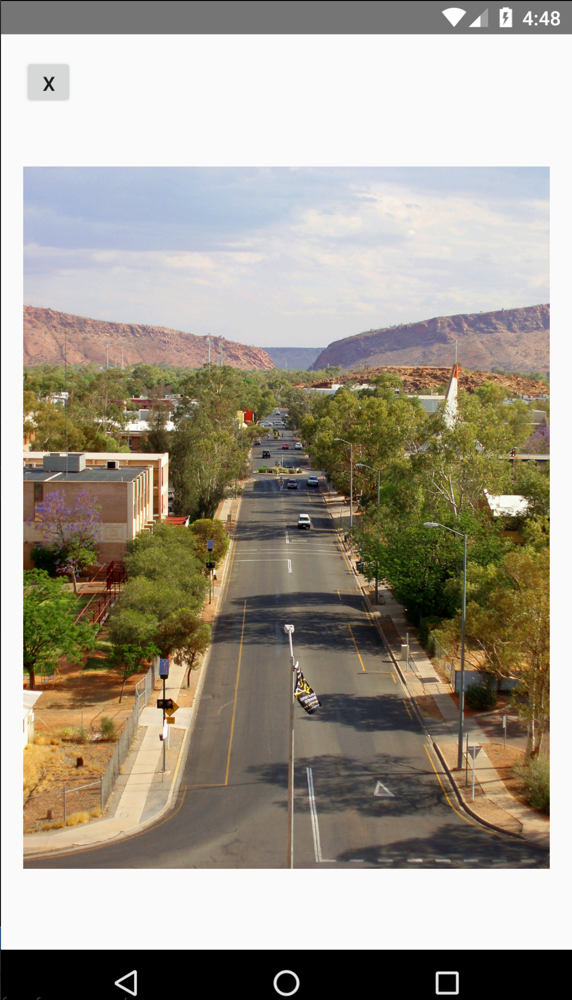

# NativeScript Plugin - FilePhotoView
A simple library for viewing an image file on Android from local storage.

> This plugin supports Android only. For iOS, recommend to use nativescript-photoview plugin.

| Android |
| ------- |
| [FilePhotoView](https://github.com/skywidesoft/FilePhotoView) |

## Background
I have an app that reads images from a protected REST API endpoints, and download into NativeScript as ImageSource. I need a photo viewer so when the thumbnail was tapped, the viewer for the photo will display with zoom functionality.

So I need a photo popup viewer that supports NS's ImageSource. I found the nativescript-photoviewer that works well in supporting this, but for Android, it only supports external URL strings that I can't provide.

Also, I found that passing an ImageSource directly to an Android library is not that strict forward (it easily cause out of memory error).

As a result, I come up a simple approach as follows:
* The image was download as NS's ImageSource instances
* When user click on the thumbnail, the ImageSource will be saved to the application cache
* The image file path will be passed to the above FilePhotoView Android library for pop up and display
  * The FilePhotoView use Glide and PhotoView behind the scene

## Installation
Run  ```tns plugin add nativescript-file-photoview``` in your ROOT directory of your project.

## Usage
The usage is very simple. Import "nativescript-file-photoview" module and create a instance of it. Call the ```show(string)``` (string is the local storage image file path) function to present the photo. 
The ```show()``` function accept a singe parameter, a string.

```js
import { Component, OnInit } from "@angular/core";
import { Observable } from 'rxjs/Rx';
import * as nshttp from 'http';
import * as fs from 'file-system';
import * as enums from 'ui/enums';

// Import the plugin
import { FilePhotoview } from 'nativescript-file-photoview';

@Component({
    selector: "ns-app",
    templateUrl: "app.component.html",
})
export class AppComponent implements OnInit { 

    imageUrl: string;

    filePhotoView = new FilePhotoview();

    ngOnInit() {

        this.imageUrl = 'https://controller1.skywidesoft.com/images/sample1.jpg';

    }

    viewPhoto() {
        console.log('View Photo');
        console.log(`imageUrl: ${this.imageUrl}`);

        // Download image and save file to application cache
        Observable.from(nshttp.getImage(this.imageUrl)).subscribe(
            image => {

                // This is the application's cache folder
                let folder = fs.knownFolders.temp();

                // Construct a unique file name for saving the image file
                let fileName = new Date().getTime() + '.jpg';
                let path = fs.path.join(folder.path, fileName);

                // Save the file
                image.saveToFile(path, enums.ImageFormat.jpg);
                console.log(`File: ${path} saved successfully`);

                // Display the photo
                this.filePhotoView.show(path);

            }
        );
    }

}
```

## Screenshots


## Help
I will accept pull requests that improve this and assign credit. 
All code is Apache 2.0 licensed.

## License
Copyright 2017 SkywideSoft

Licensed under the Apache License, Version 2.0 (the "License");
you may not use this file except in compliance with the License.
You may obtain a copy of the License at

   http://www.apache.org/licenses/LICENSE-2.0

Unless required by applicable law or agreed to in writing, software
distributed under the License is distributed on an "AS IS" BASIS,
WITHOUT WARRANTIES OR CONDITIONS OF ANY KIND, either express or implied.
See the License for the specific language governing permissions and
limitations under the License.